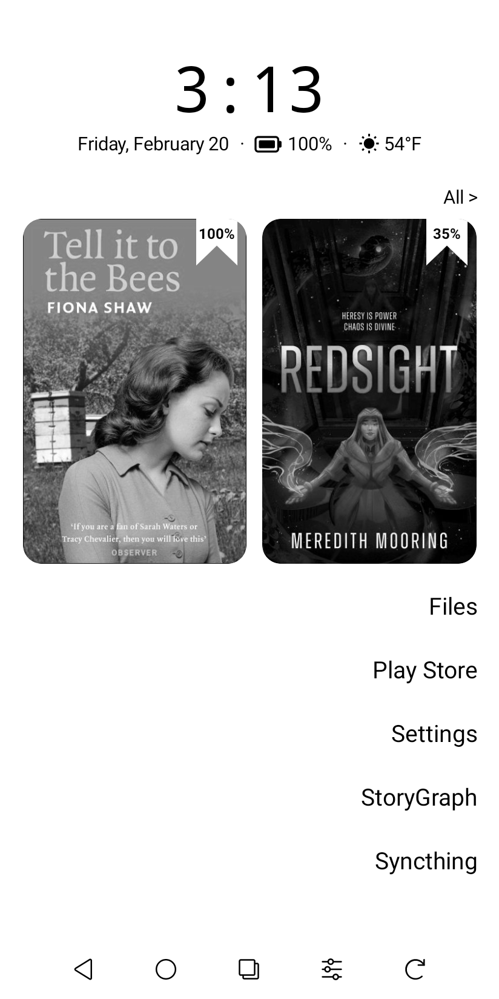

<p align="center">
  
</p>

<h3 align="center">seasalt</h3>

<p align="center">A minimal, e-ink-optimized home screen launcher for the Boox Palma.</p>

<table align="center"><tr><td>
  
</td></tr></table>

## Features

- Pure black & white UI — no grays, no animations
- Live clock with full date
- Battery icon with percentage (Canvas-drawn)
- Weather with icon and temperature via Open-Meteo API
- Right-aligned app list (text only, no icons) — discovers all apps including Boox system apps
- Long-press context menu: rename, hide, show hidden, app info
- Whitelist-based app visibility — only selected apps shown by default
- Library section: 2 most recently read book covers with progress banners
- Tap a book cover to resume reading in NeoReader
- "All >" link opens Boox system library

## Setup

Requires Android SDK 34. Connect your Boox Palma via USB, then:

```bash
./gradlew installDebug
adb shell pm enable com.seasalt.launcher
```

Press the home button and select seasalt.
